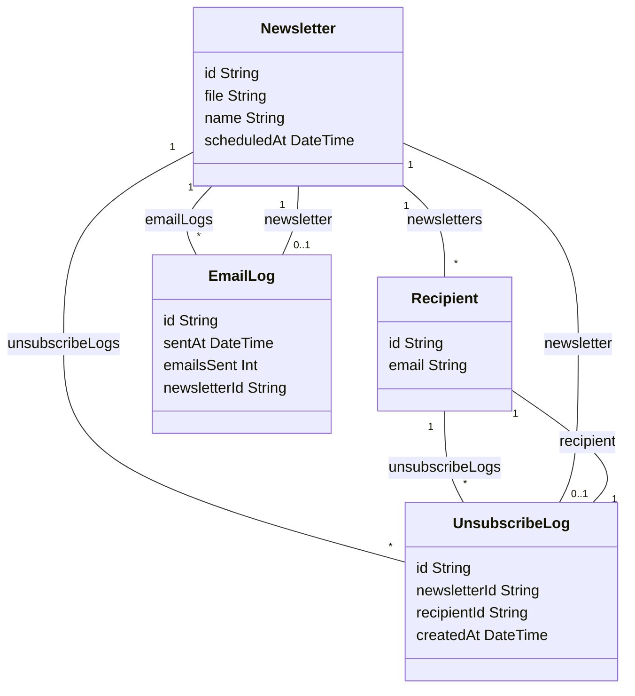

# Subscribify
<p align="center"></p>


Subscribify is a project that enables users to craft and dispatch newsletters effortlessly. With Subscribify, you can create engaging newsletters, manage subscriber lists, and schedule distributions seamlessly. 

## Features

-  User can upload a pdf or png image (the newsletter)
- User can submit an email list of recipients of the newsletter
- User can add a single email to the recipient list
- User can click a button to trigger the newsletter submission
- PDF of png document attached to the email
- Recipient users can unsubscribe from specific newsletter
- Email is personalized and using html format
- Statistics dashboard
- Newsletter sending can be scheduled


## Tech Stack

**Client:** React, Nextjs, Typescript, Emotion, Tanstack Query, Vitest

**Server:** Nestjs, Postgres, Prisma, Typescript, AWS SES


## Installation
1. Add .envs files in root, api, and web folders (use .env.example for reference)
2. Create a Dockerfile file based on the Dockerfile.development or just rename it to Dockerfile

3. Install Subscribify with docker-compose

```bash
    docker-compose up --build
```
3. Run migrations
```bash
    docker-compose exec api npm run prisma:migrate
```
4. Seed the DB
```bash
    docker-compose exec api npm run seed
```
The API is run on port 5000, the web dashboard on port 3000.

You can also run it locally installing dependencies on each folder and running `yarn start:dev` on api and `yarn dev` on web


## Documentation
- [API Swagger](https://subscribify-production.up.railway.app/api)
### DB

### Architecture


## Demo

## Important note for demo
The email sending is disabled right now as the aws SES account is still on validation for prod usage, currently it is on sandbox mode allowing the email sending to specific emails.


[Demo link](https://subscribify-iota.vercel.app/)


## Running Tests

### Unit tests
To run the unit tests, run the following command on web folder

```bash
  yarn test
```
### E2E tests
To run the e2e test, run the following command on web folder
```bash
  yarn test:e2e
``````

## Next improvements
Some improvements that could be added on next releases
- Ability to have diferent admin users
- More metrics and info
- More files types accepted
- Ability to customize email style and text
